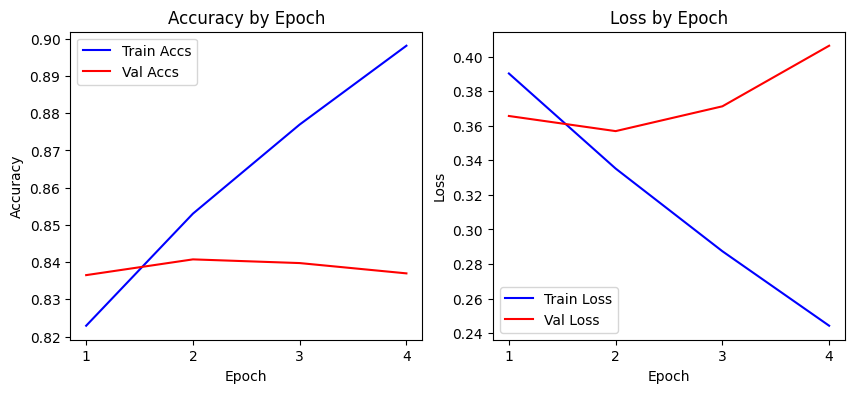
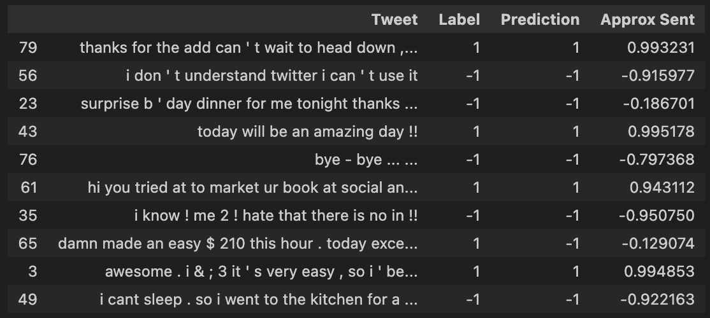

# Transfer Learning with DistilBert for Sentiment140

## Link

WandB: https://wandb.ai/arth-shukla/Sentiment140%20with%20Fine-Tuned%20DistilBERT

## Resources Used

I used the Stanford Sentiment140 dataset: http://help.sentiment140.com/for-students

## Technologies Used

Algorithms/Concepts: Transformers, Transfer Learning, BERT/DistilBERT, Sentiment Analysis

AI Development: Pytorch (Torch, Datasets, Dataloaders, Cuda), HuggingFace Transformers Library, DistilBERT

## Evaluation and Inference

More Figures available on WandB: https://wandb.ai/arth-shukla/Sentiment140%20with%20Fine-Tuned%20DistilBERT

From training, it seems only about 2 epochs were necessary, as after this point the model started overfitting on the train data.

    

The probabilities for each classification (run model outputs through softmax) can be used to get an expected value for the Tweet sentiment. Here, a negative and positive values correspond with negative and positive sentiment.

    

All told, ~85% accuracy is not bad for a dataset as large and with as varied text data as Sentiment140, but a more effective algorithm would likely need to split each Tweet by category (likely unsupervised, since there are so many different communities and linguistic styles on Twitter), then pass that data to whichever relevant model.

## Future Experiments

Next up I'll be using DistilBert for question and answer to make a more interesting tool.

## About Me

Arth Shukla [Site](https://arth.website) | [GitHub](https://github.com/arth-shukla) | [LinkedIn](https://www.linkedin.com/in/arth-shukla/)
